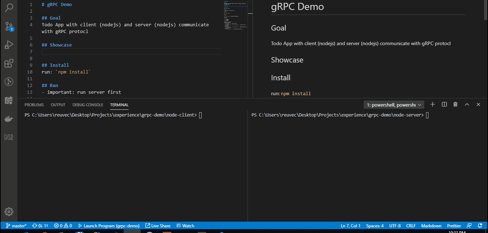

# gRPC Demo

## Goal
Todo App with client (nodejs) and server (nodejs) communicate with gRPC protocl

## Showcase

## Install
run: `npm install`

## Run
- important: run server first

Server:

run `node server`

Client:

run `node client` {commands} {arguments}

commands:

- c = create
- u = update 
- d = delete 

Example for commands:
- Get All Todos
    - `node client` - see all todos
- Create Todo
    - `node client c "create application"` - create new todo with text
- Update Todo
    - `node client u 1 "test application"` - update todo with id 1 with new text
- Delete Todo
    - `node client d 1` - will delete todo with id 1